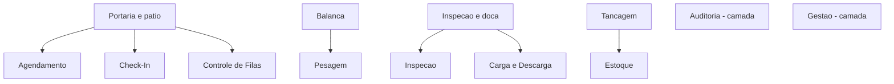

# Copy do Totem Autoload

Fonte: `config/stages.ts`, `config/tour.ts`, `config/scenarios.ts` e os componentes em `components/`.
Todo o texto é pt-BR e vive em config estática — não há backend.

> [!info] Estrutura
> O pátio tem **locais** (`places`), e cada local guarda uma ou mais **etapas** (`stages`).
> Duas etapas são **camadas** (`layer: true`): leituras que atravessam a operação inteira e por isso não têm pino no mapa.

## Mapa da copy

## Locais

| Local | `id` | Etapas |
|---|---|---|
| Portaria e pátio | `portaria` | Agendamento · Check-In · Controle de Filas |
| Balança | `balanca` | Pesagem |
| Tancagem | `tancagem` | Estoque |
| Inspeção e doca | `doca` | Inspeção · Carga e Descarga |

## Etapas

### Check In - Check Out

- **`id`:** `checkin` · **Chip:** `Check-In` · **Local:** Portaria e pátio
- **Vídeo:** `/videos/checkin-checkout.mp4`

> Registro automático de entrada e saída do motorista na portaria, com validação de documentos e liberação de acesso ao pátio em segundos.

### Agendamento - Etapa Inicial

- **`id`:** `agendamento` · **Chip:** `Agendamento` · **Local:** Portaria e pátio
- **Vídeo:** `/videos/agendamento.mp4`

> Motoristas e transportadoras agendam a janela de carga com antecedência, reduzindo filas e organizando o fluxo de chegada ao terminal.

### Controle de Filas

- **`id`:** `filas` · **Chip:** `Controle de Filas` · **Local:** Portaria e pátio
- **Vídeo:** `/videos/controle-filas.mp4`

> Painel de chamada organiza a ordem de atendimento dos caminhões no pátio, priorizando por horário de agendamento e disponibilidade das docas.

### Pesagem Inicial e Final

- **`id`:** `pesagem` · **Chip:** `Pesagem` · **Local:** Balança
- **Vídeo:** `/videos/pesagem.mp4`

> Pesagem automatizada na entrada e na saída, com captura de peso bruto, tara e líquido integrada diretamente ao sistema operacional.

### Inspeção - Checklist Digital

- **`id`:** `inspecao` · **Chip:** `Inspeção` · **Local:** Inspeção e doca
- **Vídeo:** `/videos/inspecao.mp4`

> Checklist digital de inspeção veicular e de carga, com registro fotográfico e liberação condicionada à conformidade dos itens verificados.

### Carga e Descarga - Dashboards e Telemetria

- **`id`:** `carga-descarga` · **Chip:** `Carga e Descarga` · **Local:** Inspeção e doca
- **Vídeo:** `/videos/carga-descarga.mp4`

> Acompanhamento em tempo real da carga e descarga por telemetria, com dashboards de vazão, tempo de doca e status de cada operação.

### Estoque - Inventário e Tancagem

- **`id`:** `estoque` · **Chip:** `Estoque` · **Local:** Tancagem
- **Vídeo:** `/videos/estoque.mp4`

> Controle de inventário e tancagem com leitura contínua de níveis, permitindo rastrear disponibilidade de produto por tanque em tempo real.

## Camadas

> [!abstract] O que é uma camada
> Etapas com `layer: true` — leem a operação inteira em vez de acontecer em um ponto do pátio. Não recebem pino no mapa.

### Auditoria - Registros e Rastreabilidade

- **`id`:** `auditoria` · **Chip:** `Auditoria`
- **Vídeo:** `/videos/auditoria.mp4`

> Trilha de auditoria completa de cada movimentação, com registros e evidências rastreáveis para conferência e compliance.

### Dashboard de Gestão - Acompanhamento de movimentações

- **`id`:** `gestao` · **Chip:** `Gestão`
- **Vídeo:** `/videos/dashboard-gestao.mp4`

> Dashboard de gestão consolida indicadores de todas as etapas da operação, dando visibilidade ponta a ponta do pátio para a liderança.

### AutoIntelligence - Assistente de IA do Autoload

- **Vídeo:** `/videos/autointelligence.mp4` · acessado pelo botão flutuante, sem descrição própria.

## Tour guiado

Segue a ordem física que o caminhão percorre. Total: ~2 min.

### 01 · Visão geral do terminal — 17s

> Este é o terminal completo: portaria, balanças, pátio de manobras, parque de tanques, ferrovia e píer. O Autoload acompanha cada caminhão do agendamento até a saída — é esse percurso que vamos seguir agora.

### 02 · Portaria — 14s

> Tudo começa na portaria. O caminhão chega com janela agendada e o sistema já sabe quem é, o que traz e para onde vai. Sem papel, sem fila na guarita.

### 03 · Check-in e check-out — 17s

> No check-in, documentos e dados do motorista são validados automaticamente. A liberação de acesso ao pátio sai em segundos e o cronômetro da operação começa a contar.

### 04 · Pesagem — 15s

> A balança captura peso bruto, tara e líquido sem intervenção manual. O valor entra direto no sistema operacional — nada é digitado duas vezes.

### 05 · Inspeção — 15s

> O checklist digital registra a inspeção do veículo e da carga com foto. Se algum item não estiver conforme, a liberação simplesmente não acontece.

### 06 · Carga e descarga — 16s

> Na plataforma, a operação é acompanhada em tempo real: volume, tempo de doca e ocorrências ficam registrados enquanto o caminhão ainda está carregando.

### 07 · Estoque — 13s

> Cada movimentação atualiza o saldo do parque de tanques na hora. O estoque que o gestor vê é o estoque que está no tanque.

### 08 · Auditoria e gestão — 22s

> Toda a operação fica auditável: quem liberou, quando e com qual documento. E o painel de gestão consolida filas, tempos e volumes do terminal inteiro em um lugar só.

## Cenários de simulação

Linha de base: ==18 caminhões por hora== chegando ao portão.

### Operação normal (`normal`)

- **Resumo:** 18 caminhões por hora, todas as estações em capacidade nominal.
- **Insight:** A linha de base. Toda estação opera abaixo de 80% de ocupação, então as filas se dissolvem sozinhas entre as chegadas.

### Fluxo +30% (`pico`)

- **Resumo:** Trinta por cento mais caminhões chegando, mesma estrutura para atender.
- **Insight:** A capacidade não some — só deixa de sobrar. A carga e descarga passa de 75% para quase 98% de ocupação, e é aí que a fila deixa de escoar.

### Falha em uma balança (`balanca`)

- **Resumo:** Uma das duas balanças fora de operação; a pesagem atende com pouco mais da metade do ritmo.
- **Insight:** A pesagem passa a atender menos caminhões do que chegam. A fila não estabiliza e o terminal inteiro passa a produzir no ritmo da balança que restou.

### Tanque indisponível (`tanque`)

- **Resumo:** Um tanque bloqueado tira parte das posições de carga e descarga.
- **Insight:** O terminal continua atendendo todos os caminhões do dia — mas cada um espera muito mais na doca. Perda de tempo, não de volume.

### Inspeção reprovada (`inspecao`)

- **Resumo:** Cerca de um em cada seis caminhões volta para uma segunda inspeção.
- **Insight:** O retrabalho fica contido na inspeção e não derruba o terminal — mas consome a folga que absorveria qualquer outro imprevisto no mesmo dia.

### Congestionamento na portaria (`portaria`)

- **Resumo:** Validação lenta na entrada derruba o ritmo de liberação do check-in.
- **Insight:** Nenhum caminhão é perdido e nenhuma etapa seguinte fica sobrecarregada — a portaria simplesmente atrasa o dia inteiro antes que ele comece.

## Microcopy de interface

| Onde | Texto |
|---|---|
| Painel vazio (`StagePanel`) | Arraste a planta para explorar. Toque em um ponto do pátio ou escolha uma etapa abaixo. |
| Botão do painel | Assistir vídeo da etapa |
| Título do mapa sem seleção | Visão geral do terminal |
| Botão de reset do mapa | ↗ Visão geral (aria-label: *Voltar à visão geral*) |
| Erro de vídeo | Não foi possível carregar o vídeo. |
| Cartão do tour | `{n} etapas · cerca de {min} min` |
